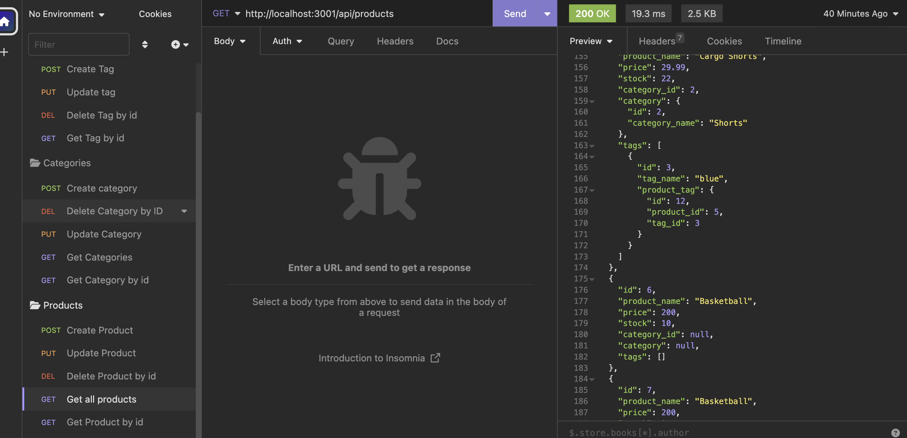

# E-commerce

## Description

This back-end database utilizes Express.js API and Sequelize to connect to the MySQL database. Tailored for e-commerce functionalitly, users are allows to create a backend database that allows to POST, GET, PUT, and DELETE data to display different products, prices tags, and other ways to manipulate data. This project challenged me to show that I am able to connect to a MySQL database utilizing Sequelize. As well as showing relevant data in JSON. All in a dynamic database that can be changed via user input.

## Table of Contents

- [Installation](#installation)
- [Usage](#usage)
- [License](#license)

## Installation

Install required dependencies by running 'npm i' and make needed changes if any to the '.env' file.

## Usage

1. Navigate to the db folder and create the database from the schema.sql folder using MySQL shell commands
2. Run 'npm run seed' to populate the database with the test data. 
3. Run 'npm start' or 'node server.js' to start the server and initialize Sequalize models to the database. 
4. Open Insomnia and navigate to http://localhost:3001 
5. Practice using relative route end points and utilize different HTTP Methods to GET, PUT, POST, and DELETE data in the database.
    
    
    
    

## License

MIT Licensing information can be found in the LICENSE file associated with this repository.

